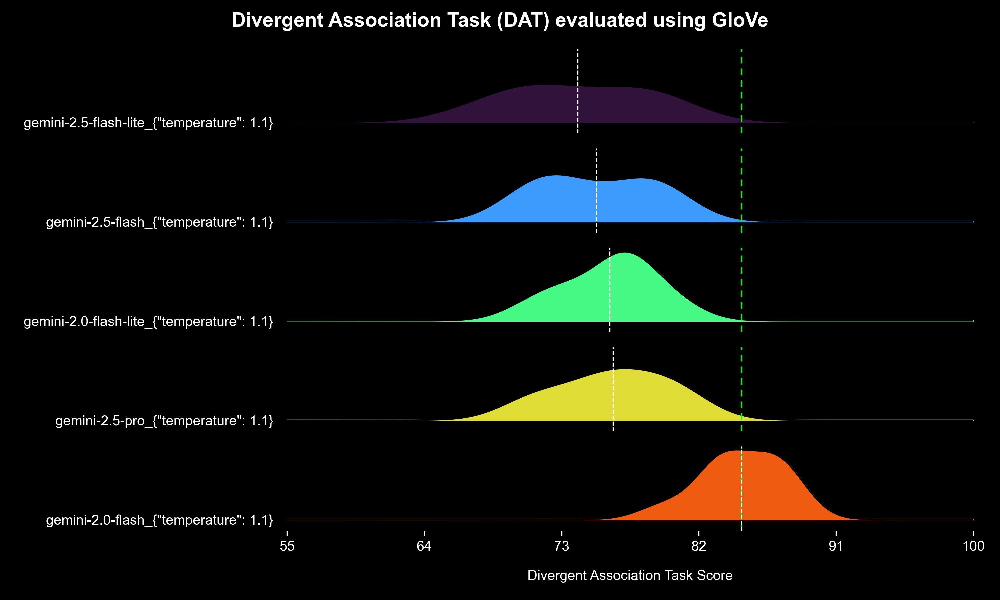
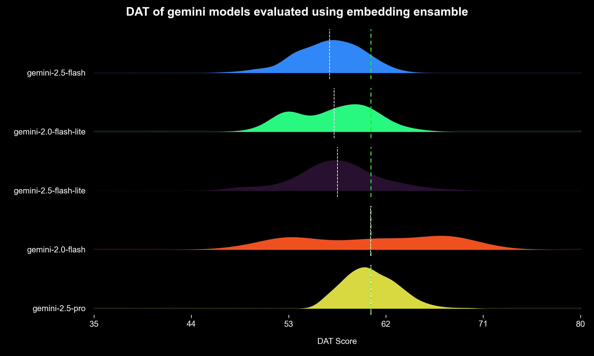
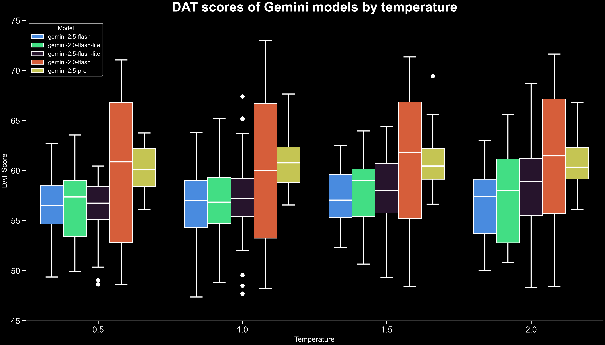
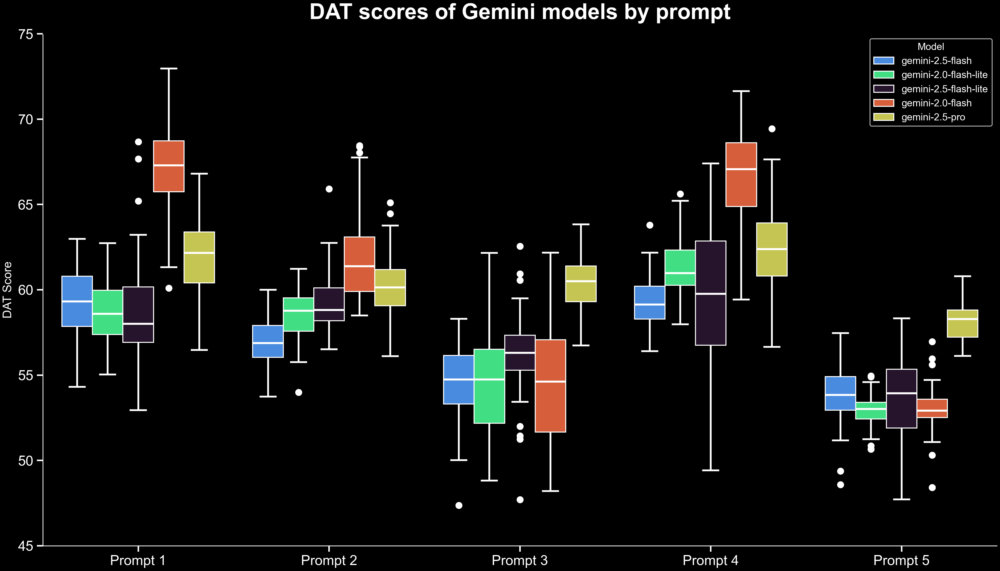
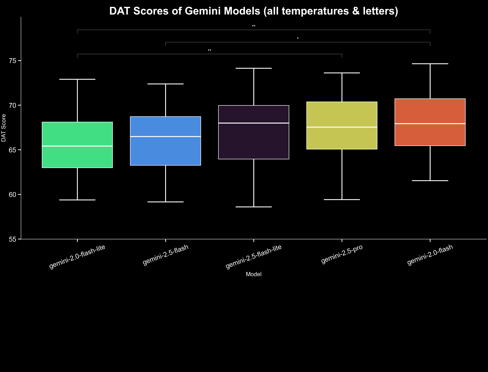
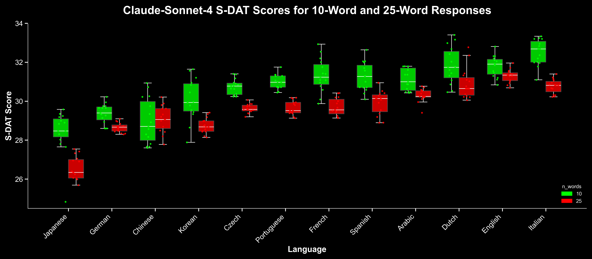

# GSoC 2025: Creation of a Divergent Thinking Benchmark

**Contributor:** [Green Code](https://github.com/theGreen-Coder) \
**Organization:** [Google DeepMind](https://github.com/google-deepmind) \
**Mentor:** [Paige Bailey](https://github.com/dynamicwebpaige) \
**Project:** [Creation of a Creative Thinking Benchmark](https://summerofcode.withgoogle.com/programs/2025/projects/TSDUDJNY)

## 📄 Deliverables

[](https://github.com/theGreen-Coder/MCTB)  
[](https://www.youtube.com/@Green-Code/videos) TO DOOOOO! \

## 📝 Project Description
An open-source multimodal creative thinking benchmark developed as part of Google Summer of Code (GSoC) under the mentorship of Paige Bailey ([@dynamicwebpaige]((https://github.com/dynamicwebpaige))) and Google DeepMind ([@google-deepmind](https://github.com/google-deepmind)).

## Abstract
Creativity has been extensively studied through the use of empirical methods ranging from case studies and psychometric tests to neuroscientific imaging and computational modeling. Within the field, J. P. Guilford identified divergent and convergent thinking as fundamental processes of creative cognition. While convergent thinking relates to the ability to arrive at a single and optimal solution, divergent thinking emphasizes the generation of multiple, novel, and flexible ideas. In fact, divergent thinking is a crucial part of the creative thinking process.

With the raise in popularity of large language models (LLMs), a large number of benchmarks have been created to evaluate the capabilities and reasoning abilities of LLMs (e.g. MMLU, HumanEval, GSM8K, etc.). However, several challenges remain in accurately assessing these capabilities. \
To start with, current benchmarks are convergent by nature and therefore, fall short in capturing the full scope of creativity in LLMs. In addition, many benchmarks overlap with LLM training data, raising concerns about data contamination and inflated performance.

In the current project, several psychometric tests of divergent thinking were performed to LLMs in order to evaluate their creative potential beyond convergent benchmarks. Among these, the Divergent Associations Task (DAT), the Synthetic-Divergent Association Task (S-DAT), the Divergent Semantic Integration (DSI) task, and the Alternative Uses Test (AUT) were adapted to the LLM setting.

Several state of the art LLMs were evaluated such as gemini-2.5-pro, as well as several other models from the Gemini and Gemma family (e.g. gemini-2.5-flash/-lite, gemini-2.0-flash/-lite, gemma-3n-e4b-it). In addition, GPT-5 and claude-sonnet-4 were also evaluated in some selected tests (due to budget constraints). While these results are by no means definitive and much more extensive experimentation is required, they offer an initial glimpse into the divergent thinking capabilites of current state of the art LLMs.

Finally, to facilitate transparency and reproducibility, the complete implementation is available as open source, allowing researchers and practitioners to access the codebase and extend the experiments.

## Background
### Why is divergent thinking important?
Creativity is one of the most important drivers of innovation, and problem-solving. It enables advances in science, technology, and the arts, and allows individuals to develop novel and valuable solutions to complex challenges. Within the psychology of creativity, divergent thinking has been consistently recognized as a key cognitive process. Unlike convergent thinking which seeks a single and most optimal answer, divergent thinking encourages the generation of multiple, original, and creative ideas.

As [[1]](#1) defines it:
> "...Divergent thinking is the ability to take different directions from the prevailing modes of thought or expression. As the name implies, this type of thinking breaks away from established concepts and produces novel ideas, which can serve as the basis for the development of a creative product. Divergent thinking often produces multiple new ideas."

However, it is the combination of both convergent and divergent thinking that drives innovation. To produce novel and creative solutions to real world problems, a general two-step process is often required. First generate a variety of creative solutions addressing the problem (divergent thinking), and then analyze their feasibility and select the most optimal solution.

As [[2]](#2) puts it:
> ...creativity often emerges from a dynamic interplay between divergent and convergent thinking. While DT expands the space of possibilities, convergent thinking involves narrowing those possibilities down to a viable, coherent solution using logic and critical reasoning [[3]](#3),[[4]](#4).

In recent years, LLMs have achieved great improvement in their divergent thinking capabilities. In fact, LLMs have been shown to demonstrate both individual, and collective creativity comparable to humans in several divergent thinking and creative tasks [[5]](#5). In fact, in some tests, they have even surpassed human performance. In the 2024 study [[6]](#6), Bellemare-Pepin et al. collected 100,000 human responses on the Divergent Association Task (DAT), which measures creativity by asking for lists of semantically distant words (DAT will be explained in more detail in the following sections). The results showed that GPT-4, on average, outperformed human participants on the DAT test.

Since then, even more advanced LLMs have been developed and released to the public, including GPT-4o, GPT-5, Gemini-2.5-Pro, Gemini-2.5-Flash, DeepSeek-v3.1, among others. These new models might not only match but even exceed human creativity across a broader range of tasks, demonstrating higher originality, and creativity than earlier LLMs.

While raising ethical considerations, ranging from intellectual property to societal impact; the semi-automation, and potentially even the full automation, of creative and problem solving tasks through LLMs could have profound consequences. It may redefine how industries approach innovation, shorten research cycles, and even accelerate the generation of scientific ideas, as suggested by [[7]](#7).

### Psychometric tests of divergent thinking
Assessing the divergent thinking capabilities of both humans and LLMs requires adopting an empirical approach. However, unlike other cognitive abilities (such as logical reasoning and memory), creativity is inherently more subjective and context-dependent, making its measurement more challenging.

Beginning in the 20th century, numerous tests were developed to evaluate human creativity. One notable example is the Abbreviated Torrance Test for Adults (ATTA), derived from the Torrance Tests of Creative Thinking originaly designed by Ellis Torrance [[8]](#8). Subjects are evaluated based on three tests (two visual and one verbal) [[1]](#1). For instance, subjects are asked questions like the following: "Just suppose you could walk on air or fly without being in an airplane or similar vehicle. What problems might this create? List as many as you can.". All activities are timed and responses are scored on fluency, flexibility, originality, and answer elaboration [[8]](#8).

Another common divergent creativity test is the Alternative Uses Test (AUT) [[9]](#9),[[10]](#10). Developed by J. P. Guilford, it asks subjects to list as many alternative uses for a particular object as possible. Responses are rated on fluency, flexibility, and originality. For instance, when participants are asked to generate alternative uses for a brick, a response such as "to build a wall" would typically receive a low originality score. However, a response such as "as a bookend" would receive a moderate score, as it a bit more original. Finally, a response such as "grind into powder to create red paint" would receive a high originality score (as it is uncommon and creative).

### Modern Tests of Divergent Thinking 
While the ATTA and AUT tests have been used for decades to evaluate divergent thinking, recent advances in natural language processing [[11]](#11),[[12]](#12) have facilitated the emergance of new divergent thinking tests.

#### Divergent Association Task (DAT)
In 2021, Olson et al. proposed the Divergent Association Task (DAT) [[13]](#13). Subjects are asked to name 10 words that are as different from each other as possible. No proper nouns or specialised vocabulary is allowed. In addition, all responses must be single-word nouns. The semantic distance between all words is computed using a word to vector model such as GloVe (Global Vectors for Word Representation). GloVe is trained on a large text corpus to build a word co-occurrence matrix, which captures how often words appear together. It then applies a regression-based model to this matrix to learn vector representations of words [[11]](#11).

The resulting word embeddings can be used to calculate the semantic similarity between words. Words that often co-occur together will have similar vector embeddings, while unrelated words will have radically different vector embeddings. This measure of similarity can be calculated using cosine similarity:

$$\text{Cosine Similarity} = \frac{\vec{A} \cdot \vec{B}}{\|\vec{A}\| \|\vec{B}\|}$$

where $\vec{A}$ and $\vec{B}$ are the vector embedding of two words. If $\hat{A}$ and $\hat{B}$ are unit vectors, cosine similarity is simply calculated by the dot product between the two vectors:

$$
\hat{A} = \frac{\vec{A}}{|\vec{A}|},
\quad
\hat{B} = \frac{\vec{B}}{|\vec{B}|},
\quad
\text{Cosine Similarity} = \hat{A} \cdot \hat{B}
$$
where $\hat{A}$ and $\hat{B}$ are the unit vectors in the direction of $\vec{A}$ and $\vec{B}$. In addition, semantic distance is defined as:
$$
\text{Semantic Distance} = 1 - \hat{A} \cdot \hat{B} = 1 - \text{Cosine Similarity}
$$

For example, calculating the semantic distance using GloVe of "dog" and "cat" results in a score of $0.1983$. This is coherent with the fact that both of these words are used relatively frequently together. By contrast, "dog" and "algorithm" yield a semantic distance of $0.9555$, which is similarly consistent with their much weaker association.

When calculating DAT scores, the average semantic distance is calculated among all words. In a similar fashion, highly related words such as [`arm`, `eyes`, `feet`, `hand`, `head`, `leg`, `body`] results in a DAT score of $50.31$, while [`lamp`, `algorithm`, `golf`, `playground`, `orchestra`, `spaghetti`, `crocodile`] results in $88.52$. (Note that that DAT scores muliply the average semantic distance by 100).

Olson et al. tested the validity of DAT, with a cohort of almost 9,000 subjects. They performed both DAT and AUT to all subjects and found a moderate to strong correlations between DAT and other commonly used creativity measures[[13]](#13).

#### Divergent Semantic Integration (DSI)
In addition to DAT, Johnson et al. proposed Divergent Semantic Integration (DSI) in 2022 [[14]](#14). DSI takes advantage of context-sensitive word embeddings to evaluate creative writing. DSI uses BERT [[12]](#12) to derive context-dependent word embeddings for each word within every full sentence. Then the semantic distance between every possible pair of word embeddings in a story is computed and averaged. A higher average distance reflects a story that connects more semantically divergent ideas. Drawing on Mednick’s associative theory of creativity, the authors hypothesize that:

> "...According to associative theory, creativity involves making connections between remote concepts stored in memory, and individual differences in creativity can be attributed to variation in the strength of associations between concepts. Thus, a less creative person has strong associations between common connections (e.g., table–chair), and weak associations between uncommon connections (e.g., table–splendid). With a more creative person, in contrast, common and uncommon connections are of similar strength, which presumably makes it easier for them to overcome dominant associations (e.g., table–chair) in favor of more efficiently connecting remote associations (e.g., table–splendid)."

Although DSI does not directly assess divergent thinking, its close relationship to it makes evaluating DSI in humans and LLMs worthwhile. The association of remote concepts and ideas is central to divergent thinking. Therefore, DSI serves as a useful proxy for measuring this core component of divergent thinking.

Bellemare-Pepin et al. also investigated creative writing in both humans and LLMs through DSI [[6]](#6). Their findings showed that, on average, humans had a slight edge over models such as GPT-4 and GPT-3. Notably, principal component analysis (PCA) embeddings of the creative responses revealed a clear separation between human- and LLM-generated stories.

## Motivation and Goals
While there exist many benchmarks assessing the convergent thinking and problem-solving capabilities of LLMs [[15]](#15),[[16]](#16),[[17]](#17), there is a lack of evaluation frameworks for measuring divergent thinking in LLMs. According to J. P. Guilford, divergent thinking is a key component of the creative process. Therefore, having a way to quantify divergent thinking might prove useful for systematically evaluating and comparing the creativity of LLMs.

One might reasonably assume that larger models with enhanced reasoning capabilities would demonstrate superior performance divergent thinking evaluation. However, as evidenced in `LiveIdeaBench`[[7]](#7), comparatively smaller models like `QwQ-32B-preview` can outperform larger reasoning models such as `claude-3.7-Sonnet:thinking` in scientific idea generation. This shows the need to test divergent thinking empirically rather than assume it scales with model size.

Furthermore, traditional benchmarks are not always reliable indicators of real-world problem-solving performance. Recent studies have highlighted inherent limitations of widely used benchmarks in accurately evaluating large language models [[18]](#18),[[19]](#19). In contrast, divergent thinking tests may be less prone to overfitting or memorization, as they often lack a single optimal solution and such solutions are not widely available online. This makes them a potentially more robust measure of a model’s creative capabilities compared to conventional benchmarks.

Therefore, this projects aims to:

- Evaluate state of the art LLMs on psychometric divergent thinking tests
- Evaluate the impact of reasoning-focused fine-tuning and prompting on divergent thinking abilities.
- Provide an open-source codebase to facilitate this process

## Results and Discussion
### Divergent Association Task (DAT)
To start exploring the results of DAT, several models of the Gemini family were evaluated on DAT using the prompt from the original DAT paper [[13]](#13):

> Please enter 10 words that are as different from each other as possible, in all meanings and uses of the words. Rules: Only single words in English. Only nouns (e.g., things, objects, concepts). No proper nouns (e.g., no specific people or places). No specialized vocabulary (e.g., no technical terms). Think of the words on your own (e.g., do not just look at objects in your surroundings). Make a list of these 10 words, a single word in each entry of the list. Do not write anything else but the 10 words.

#### <ins>Gemini-2.0-flash outperforms other gemini models in original DAT</ins>
DAT was repeated ten times for each model. For each run, GloVe word embeddings (trained on 840B Common Crawl tokens) were used to compute the average semantic distance across all word pairs. These averaged scores were then plotted to compare model performance (Figure 1 below).

<figure>
  
  <figcaption><strong>Figure 1.</strong> Divergent Association Task (DAT) evaluated using GloVe. DAT scores were obtained using GloVe 840B and repeated ten times for each model. Models were prompted using instructions from the original DAT paper. All models were evaluated at a temperature of 1.1.</figcaption>
</figure>

The highest DAT average score ($84.78$) was achieved by `gemini-2.0-flash`, which notably outperformed larger models such as `gemini-2.5-pro` despite their state of the art performance on reasoning and other benchmarks. However, before drawing any conclusions, there are several caveats that must be addressed.

#### <ins>Key variables influencing DAT performance</ins>
To start with, the models were evaluated using a single prompt. Given that prompt wording and format can strongly influence LLM performance and output [[13]](#13), the subsequent DAT evaluations employed five distinct prompts, each used individually. All prompts can be seen in [the DAT.py code](creative_tests/DAT.py). Instructions were practically identical in all five cases, with only variations in wording and format.

Temperature has also been shown to influence DAT scores. In [[6]](#6), Bellemare-Pepin et al. reported a statistically significant difference in GPT-4's DAT scores across three temperature settings (low = 0.5, mid = 1.0, high = 1.5). Higher temperatures yielded substantially higher scores. While the impact of temperature on `gemini-2.5-flash` will be examined later, the models were evaluated under these three temperature settings and their results plotted together in the subsequent DAT analyses.

Finally, and perhaps most importantly, the choice of word embedding model plays a critical role. Throughout this project, we observed that different embedding models significantly influenced the performance of DAT. Consequently, we carried out a thorough investigation to identify the most accurate and fair embedding models. In the original DAT paper [[13]](#13), they performed both DAT and AUT on over 300 different paper. Therefore, that data can be used to see what embedding models can generate a DAT score with a higher correlation of several AUT metrics. Data from Study 1A and Study 1B (see original DAT paper [[13]](#13)) was combined and correlation scores can be seen in Table 1 and Table 2.

**Table 1.** Correlations of DAT scores using different embeddings with AUT flexibility, originality, and fluency scores. (n=366)
|       | AUT Flexibility | AUT Originality | AUT Fluency |
|-------|-------------|-------------|---------|
| GloVe                                      | 0.3205        | 0.2717        | 0.2317    |
| BERT (Layer 6)                             | **0.3415**    | **0.2826**    | **0.2369**|
| BERT (Layer 7)                             | 0.3203        | 0.2590        | 0.2290    |
| FastText                                   | 0.2151        | 0.2011        | 0.1686    |
| Word2Vec                                   | 0.1371        | 0.1417        | 0.1431    |
| Granite-Embedding-278m-multilingual        | 0.2411        | 0.2018        | 0.1282    |
| Sentence-BERT                              | 0.3028        | 0.2484        | 0.2025    |

*Note that the original DAT paper reported different correlation values ($0.34$ flexibility, $0.32$ originality, and $0.22$ fluency). However, that was only using Study 1A instead of both Study 1A and 1B combined.*

**Table 2.** Correlations of DAT scores using different embedding ensambles with AUT flexibility, originality, and fluency scores . (n=366)
|       | AUT Flexibility | AUT Originality | AUT Fluency |
|-------|-------------|-------------|---------|
| GloVe                                      | 0.3205        | 0.2717        | 0.2317    |
| BERT (Layer 6)                             | 0.3415        | 0.2826        | 0.2369    |
| GloVe + BERT_L6                            | **0.3653**    | **0.3064**    | **0.2593**|
| GloVe + BERT_L6 + Sentence-BERT            | 0.3616        | 0.3014        | 0.2525    |
| All embedding models from Table 1 combined | 0.3383        | 0.2879        | 0.2450    |

As seen in Table 1, word embeddings from BERT (Layer 6) yielded the highest correlations across all AUT metrics. In particular, DAT scores derived from BERT (Layer 6) achieved a correlation of $0.2826$ with AUT originality and $0.3415$ with AUT flexibility. Both exceeded the performance of GloVe, the original embedding model used in DAT. BERT (Layer 7) produced correlation values comparable to those of GloVe, whereas other models such as FastText, or Word2Vec showed substantially lower correlations. Granite-Embedding-278m-multilingual showed similar correlations as reported in [[2]](#2) (more on S-DAT in the following sections). Across all models, correlations with AUT fluency were noticeably weaker, which is expected since fluency primarily reflects the quantity of ideas generated during AUT rather than the semantic quality or divergence of ideas.

The correlation of several embedding ensambles is also reported in Table 2. For each ensemble, DAT scores were first computed separately using the individual models, and then averaged across all models to obtain the final score. As shown, the ensemble combining GloVe and BERT_L6 not only surpassed the original GloVe model, but also exceeded the best-performing individual model, achieving correlation values of $0.3653$, $0.3064$, and $0.2593$ for flexibility, originality and fluency, respectively.

It is worth noting that the true correlation between DAT and AUT scores is unknown, since ground truth cannot be empirically determined. However, it is reasonable to assume that higher correlations indicate greater accuracy, given that both DAT and AUT assess similar aspects of divergent thinking. Therefore, in the following sections all DAT scores will be calculated using the previously mentioned GloVe + BERT_L6 word embedding ensamble.

#### <ins>Robust DAT results after addressing key variables</ins>
All of the key factors previously mention were taken into account, resulting in the outcomes shown in Figure 2. The figure caption details the specific changes in this robust DAT evaluation compared to the original. In addition, note that while the numerical DAT scores differ from Figure 1 due to the use of the embedding ensemble, the relative comparisons between models remain just as valid for Figure 2.

<figure>
  
  <figcaption><strong>Figure 2.</strong> Robust DAT results for the GloVe + BERT_L6 ensemble under varied conditions. Models generated 20 words per prompt (vs. the typical 10) at temperatures 0.5, 1.0, 1.5, and 2.0. Each model-temperature configuration was repeated 50 times. In addition, five different prompt variants were used.</figcaption>
</figure>

The results indicate that `gemini-2.5-pro` and `gemini-2.0-flash` outperformed all other models by a notable margin. Although both models achieved nearly identical average DAT scores, their score distributions differed substantially. `gemini-2.5-pro` has a narrow, concentrated distribution of scores, whereas `gemini-2.0-flash` displays a broader, more dispersed range around almost the same mean as `gemini-2.5-pro`.

To further investigate the broader distribution of `gemini-2.0-flash`, Figure 3.1 and 3.2 plots the DAT scores of `gemini-2.5-pro` and `gemini-2.0-flash` across different temperatures and prompts, respectively. Other models are also plotted as reference.

<figure>
  
  <figcaption><strong>Figure 3.1.</strong> Robust DAT results plotted by temperature. Models generated 20 words per prompt at temperatures 0.5, 1.0, 1.5, and 2.0. Boxplots show the distribution of DAT scores for each model (median line, interquartile range, and whiskers).
  </figcaption>
</figure>

<figure>
  
  <figcaption><strong>Figure 3.2.</strong> Robust DAT results plotted by prompt. Models generated 20 words per prompt (vs. the typical 10) with five different prompt variants being used. Boxplots show the distribution of DAT scores for each model (median line, interquartile range, and whiskers).</figcaption>
</figure>

As observed, temperature had a negligible effect on the distributions of DAT scores. In contrast, prompt variants had a significant and observable effect on DAT score. In fact, the use of different prompts largely explains the broader distribution of `gemini-2.0-flash`’s DAT scores. This suggests that `gemini-2.0-flash` is highly sensitive to prompt variation, whereas `gemini-2.5-pro` remained comparatively consistent, although it shows slight sensitivity as well. This is notable since all prompts conveyed nearly identical instructions.

This observation also aligns with the results shown in Figure 1, since Prompt 1 was the original prompt used in the DAT evaluation. Although the distributions differ slightly due to the varied temperature settings and the use of 20 words instead of 10, the outcomes for Prompt 1 in Figures 1 and 3.2 are effectively the same.

These findings matter because many studies assessing LLMs’ divergent thinking capabilites with DAT rely solely on the original DAT prompt. Bellemare-Pepin (2024) [[6]](#6) already demonstrated that prompt strategies can strongly influence DAT outcomes, but, as far as I am aware, no prior work has isolated prompt variation itself as the driver of changes in DAT scores. Hence, using only the original DAT prompt seems to results in prompt-biased results for certain LLMs (`gemini-2.0-flash` for example).

#### <ins>Effect of temperature and thinking budget in DAT</ins>
To further investigate the effect of temperature and thinking_budget on DAT scores, `gemini-2.5-flash` was evaluate using DAT at varying temperatures and thinking_budget. The results can be see in Figure 4.

<figure>
  
  
  <figcaption><strong>Figure 4.</strong> Effect of temperature and thinking_budget on DAT scores of gemini-2.5-flash. Models were prompted with five different variants and asked to generated 20 words. Experiments were repeated fifty times for each configuration. Jitter on the x axis is only for visualization purposes.
  </figcaption>
</figure>

Temperature appears to have a negligible effect on DAT scores. This contrasts with the findings of [[6]](#6), which reported variations in DAT scores at different temperatures. Several factors may account for this difference, including the use of 20 words instead of 10, the incorporation of prompt variations, and the use of an embedding ensemble to compute semantic distances between words. However, it should be noted that the absence of a detected correlation does not necessarily imply the absence of an effect or causation.

In contrast, `thinking_budget` seems that have an effect on DAT scores. With a pearson correlation value of $0.287$, it appears that higher `thinking_budget` seem to correlate with higher DAT scores. This seems to indicate that reasoning might affect LLM's ability to generate more semantically diverse responses to DAT, thereby improving their DAT scores. Further investigation is needed to further assess this. It would be specially useful to look at the chain of thought reasoning given by `gemini-2.5-flash` at varying `thinking_budget` configurations.

### Hard Divergent Association Task (HardDAT)
#### <ins>HardDAT results show similarity with DAT despite increased complexity</ins>
HardDAT is a modified version of DAT, based on this code repository ([link here](https://github.com/lechmazur/divergent)). LLMs are given a random list of 20 words (sampled from [5k_common.txt](models/5k_common.txt)), and are asked to generate 25 new words that are semantically different between each other, as well as the given 20 words. Additionally, all 25 generated words must begin with a specific letter chosen from the set `"abcdefghiklmnoprstuwy"`. The model is asked to do this four times for every letter at different temperature settings (0.5, 1.0, 1.5, and 2.0). If curious, the actual prompt can be found in [HardDAT.py](creative_tests/HardDAT.py).

<figure>
  
  <figcaption><strong>Figure 6.</strong> HardDAT results for all Gemini models. Models were prompted with only one prompt variant and tasked with the HardDAT task (as explained above). Boxplots show the distribution of HardDAT scores for each model (median line, interquartile range, and whiskers). Statistical differences between models were assessed using pairwise two-sided Mann–Whitney U tests with Bonferroni correction for multiple comparisons. Only significant comparisons (p<0.05, after correction) are annotated with stars above the boxes (* p<0.05, ** p<0.01, *** p<0.001).
  </figcaption>
</figure>

As shown in Figure 6, `gemini-2.5-flash-lite`, `gemini-2.5-pro`, and `gemini-2.0-flash` generally outperformed `gemini-2.5-flash` and `gemini-2.0-flash-lite` (in some cases with statistical significance). Although `gemini-2.0-flash` and `gemini-2.5-flash-lite` achieved a higher median HarDAT score than `gemini-2.5-pro`, the difference was not statistically significant.

These findings are consistent with previous DAT evaluations. Therefore, the results further reinforce the good performance of `gemini-2.5-pro`, and `gemini-2.0-flash`. In Figure 7, a plot of `gemini-2.0-flash`'s HardDAT scores can be observed for each of the letters. Note that each letter was only evaluated at four different temperature settings with no repetitions (due to budget constraints). Therefore, results are only indicative and further experimentation is require to draw proper conclusions.

<figure>
  
  <figcaption><strong>Figure 7.</strong> HardDAT results for gemini-2.0-flash with different input letters. gemini-2.0-flash was evaluated through the HardDAT procedure described above. Boxplots show the distribution of HardDAT scores for each model (median line, mean diamond, interquartile range, and whiskers).
  </figcaption>
</figure>


### Synthetic-Divergent Association Task (S-DAT)
#### <ins>S-DAT results across several LLM models</ins>
In 2025, Haase et al. introduced S-DAT: *"A Multilingual, GenAI-Driven Framework for Automated Divergent Thinking Assessment"* [[2]](#2). This study extended DAT to multiple languages. Since the original **GloVe** and **BERT** models were trained only on English data, they were unsuitable for producing accurate DAT results across languages.  

To address this limitation, the Haase et al. evaluated several multilingual embedding models to identify which produced the most stable and comparable distributions between languages [[2]](#2). After performing multilingual calibration, they determined that `Granite-Embedding-278m-multilingual` was the optimal choice [[21]](#21). As demonstrated [here](https://arxiv.org/html/2505.09068v1#S3.F1.8.8), this model exhibited the lowest variation and most consistent distribution across languages.

Figure 8 presents the results of the self-evaluated S-DAT across 12 languages (English, German, Spanish, French, Japanese, Portuguese, Arabic, Czech, Italian, Korean, Dutch, and Chinese). The LLMs shown in Figure 8 are sorted from left to right by their average score. LLM models were asked to generate 10 and 25 words as semantically different as possible in those 12 languages. Each configuration was repeated 25 times. Again, note that the numerical values produced by S-DAT are not directly comparable to those from the previous DAT and HardDAT.

<figure>
  
  <figcaption><strong>Figure 8.</strong> S-DAT results evaluated using eight different LLM models from different model families. Boxplots show the distribution of S-DAT scores for each model (median line, interquartile range, and whiskers). 10-word responses are labeled as green and 25-word responses in red.
  </figcaption>
</figure>

While `Claude-Sonnet-4` achieved a slightly higher average overall (particularly on the 10-word S-DAT responses), no major differences were observed in the S-DAT distributions. Larger models such as `gemini-2.5-pro` and `gpt-5` also produced marginally higher S-DAT scores, but these differences were not statistically significant.  

Across all models, S-DAT performance showed a slight decline when LLMs were prompted to generate 25 words instead of 10. This is expected, as producing more words that diverge semantically from each other is more challenging.

To investigate the intra-model distributions across languages, Figure 9 (as well as A.1 and A.2 in the appendix) are shown.

<figure>
  
  <figcaption><strong>Figure 9.</strong> Gemini-2.5-Pro S-DAT scores accross diferent languages. Boxplots show the distribution of S-DAT scores for each model (median line, interquartile range, and whiskers). 10-word responses are labeled as green and 25-word responses in red.
  </figcaption>
</figure>

All three models (`Claude-Sonnet-4`, `gpt-5`, `gemini-2.5-pro`) seemed to perform suboptimally in languages liek Japanese and German (among others). This could also be due fact that `Granite-Embedding-278m-multilingual` is not as good at word embedding in those languages. In fact, in [[2]](#2), there is a slight drop in S-DAT scores in Japanese, which could explain this.

Figures 9 is indicative since it illustrates broad patterns and potential weaknesses rather than conclusive evidence. The same is true for Figrue A.1 (`gpt-5`'s S-DAT scores accross diferent languages), and Figure A.2 (`Claude-Sonnet-4`'s S-DAT scores accross diferent languages).

#### <ins>S-DAT scores under constraints showed no singificant results</ins>
Finally, LLMs were evaluated using S-DAT under additional constraints, where responses were restricted to nouns referring to edible items, tools, objects valued under $10, or items/phenomena that produce sound when used. Results were plotted in Figure 10.

<figure>
  
  <figcaption><strong>Figure 10.</strong> S-DAT under constraints across five models. Boxplots show the distribution of S-DAT scores for each model (median line, interquartile range, and whiskers). The legend in the bottom left indicates the labeling of each experiment.
  </figcaption>
</figure>

As seen in Figure 10, the imposed constraints seemed to generally not affect LLMs. As a result, S-DAT distributions across models were relatively similar, and no major significance was found.

*Note that prompts were translated from English directly to all other 12 languages (as I unfortunately don't speak all of them). Therefore, there might be discrepancies between prompts that might create bias in the results. In addition, the applied constraints were not systematically checked, which may also have introduced additional sources of error to the results.*

### Divergent semantic integration (DSI)
In order to evaluate creative writing, DSI was calculated across different LLMs. As explained in the background section, while DSI does not directly measure divergent thinking, it serves as a useful proxy for measuring the connection between divergent concepts (which is a core component of divergent thinking). DSI was calculated using the method explained in the original paper [[14]](#14), where context-dependent BERT embeddings are calculated and the semantic distance is computed between pairs of words.

As in the original DSI study, LLMs were instructed to write a creative story using three words as a prompt:

> Please write a five-sentence creative story with the following three-word prompt: {words}. Please include all three words, be creative and imaginative when writing the sort story. Do not write anything else, but the story.

Both low and high semantic words were provided as cue words:

```python
low = ["stamp, letter, send","belief, faith, sing","petrol, diesel, pump" "year, week, embark"]
high = ["gloom, payment, exist","organ, empire, comply","statement, stealth, detect"]
```

Each setting was repeated 3 times and the results are shown in Figure 11.

#### Only Google Results
    Only results with Google

#### Effect temperature Google
    Only results with Google

#### Effect Thinking Budget
    Only results with Google

#### Effect Prompts variants on result
    Only results with Google with prompt variants

#### Best Google vs Gemini-2.5-pro vs Other models vs Humans
    Only results with Google vs Human (PCA embeddings and shit)

### AUT
### Originality Ratings
#### Explain originality correlation evaluation table (like in organisciak)
    Test correlation of gemma3n on 8k human rated responses to brick - 0.19 percent
    Then tested 300 responses? - show table like in organisciak 2023

    Explain biases or percieved biases and cite https://arxiv.org/html/2411.15560v2

#### Temperature & Thinking Budget Effect on AUT
    Test with gemini 2.5-flash-lite the effect of temperature and thinking budget on AUT originality ratings

#### Base AUT originality with brick, box, paperclip, bottle
    Show comparison between all models

#### Gemini2.5-pro AUT brick, box, paperclip, bottle, rope, book, table, shovel
    Then, show individual plot for gemini2.5-pro across

### Flexibility Ratings
#### Base AUT flexibility with brick, box, paperclip, bottle
    Show comparison between all models

#### Gemini2.5-pro AUT brick, box, paperclip, bottle, rope, book, table, shovel
    Then, show individual plot for gemini2.5-pro across 

### Vision Based AUT
    Generate images of a brick, box, paperclip, bottle, rope, book, table, shovel with some image generator and modify the prompt.
    Add support for adding images?

## Conclusion
## 🚀 Future Work
The current project developed a comprehensive benchmark by adapting previous psychometric tests of divergent thinking to the LLM setting. In addtion, preliminary results of several state of the LLMs offer an initial glimpse into the divergent thinking capabilites of current state of the art LLMs. 

However, further work and more extensive experimentation is require to further 

## 🛠️ Usage

## 🙌 Acknowledgements
A special thank you to:  
- [Paige Bailey](https://github.com/dynamicwebpaige) for her insights and huge help through the whole duration of this project.
- [Xavier Amatriain](https://www.linkedin.com/in/xamat/) for his valuable insights and generosity with his time.
- My fellow GSoC DeepMind contributors for their feedback and inspiration (especially [@rorosaga]((https://github.com/rorosaga))).
- Anyone reading this for taking the time to check out my project! :)

---

## Additional Figures
<figure>
  
  <figcaption><strong>Figure A.1.</strong> GPT-5 S-DAT scores accross diferent languages Boxplots show the distribution of S-DAT scores for each model (median line, interquartile range, and whiskers). 10-word responses are labeled as green and 25-word responses in red.
  </figcaption>
</figure>

<figure>
  
  <figcaption><strong>Figure A.2.</strong> Claude-Sonnet-4 S-DAT scores accross diferent languages Boxplots show the distribution of S-DAT scores for each model (median line, interquartile range, and whiskers). 10-word responses are labeled as green and 25-word responses in red.
  </figcaption>
</figure>

## References

<a id="1">[1]</a> 
Creativity [🔗](https://www.sciencedirect.com/science/article/pii/B9780123750006001129#s0085)

<a id="2">[2]</a> 
S-DAT: A Multilingual, GenAI-Driven Framework for Automated Divergent Thinking Assessment [🔗](https://arxiv.org/html/2505.09068v1) 

<a id="3">[3]</a> 
In Praise of Convergent Thinking [🔗](https://www.tandfonline.com/doi/abs/10.1207/s15326934crj1803_13)

<a id="4">[4]</a> 
Divergent thinking as an indicator of creative potential. [🔗](https://doi.org/10.1080/10400419.2012.652929)

<a id="5">[5]</a> 
Large language models show both individual and collective creativity comparable to humans [🔗](https://doi.org/10.1016/j.tsc.2025.101870)

<a id="6">[6]</a> 
Divergent Creativity in Humans and Large Language Models [🔗](https://arxiv.org/abs/2405.13012)

<a id="7">[7]</a> 
LiveIdeaBench: Evaluating LLMs’ Divergent Thinking for Scientific Idea Generation with Minimal Context [🔗](https://arxiv.org/abs/2412.17596)

<a id="8">[8]</a> 
Torrance Tests of Creative Thinking [🔗](https://doi.org/10.1037/t05532-000)

<a id="9">[9]</a> 
Creativity: Yesterday, Today and Tomorrow [🔗](https://doi.org/10.1002/j.2162-6057.1967.tb00002.x)

<a id="10">[10]</a> 
Alternate Uses: Manual of Instructions and Interpretations [🔗](https://www.scirp.org/reference/referencespapers?referenceid=868834)

<a id="11">[11]</a> 
GloVe: Global Vectors for Word Representation [🔗](https://aclanthology.org/D14-1162.pdf)

<a id="12">[12]</a> 
BERT: Pre-training of Deep Bidirectional Transformers for Language Understanding [🔗](https://arxiv.org/abs/1810.04805)

<a id="13">[13]</a> 
Naming unrelated words predicts creativity (original DAT paper) [🔗](https://www.pnas.org/doi/10.1073/pnas.2022340118) 

<a id="14">[14]</a> 
Divergent semantic integration (DSI): Extracting creativity from narratives with distributional semantic modeling [🔗](https://link.springer.com/article/10.3758/s13428-022-01986-2)

<a id="15">[15]</a> 
Measuring Massive Multitask Language Understanding [🔗](https://arxiv.org/abs/2009.03300)

<a id="16">[16]</a> 
Evaluating Large Language Models Trained on Code [🔗](https://arxiv.org/abs/2107.03374)

<a id="17">[17]</a> 
Training Verifiers to Solve Math Word Problems [🔗](https://arxiv.org/abs/2110.14168)

<a id="18">[18]</a> 
GSM-Symbolic: Understanding the Limitations of Mathematical Reasoning in Large Language Models [🔗](https://arxiv.org/abs/2410.05229)

<a id="19">[19]</a> 
Line Goes Up? Inherent Limitations of Benchmarks for Evaluating Large Language Models [🔗](https://arxiv.org/html/2502.14318v1)

<a id="20">[20]</a> 
Does Prompt Formatting Have Any Impact on LLM Performance? [🔗](https://arxiv.org/pdf/2411.10541)

<a id="21">[21]</a> 
Granite Embedding 278m Multilingual model card [🔗](ttps://www.ibm.com/docs/en/watsonx/saas?topic=models-granite-embedding-278m-multilingual-model-card)


<a id="6">[6]</a> 
Automatic assessment of divergent thinking in Chinese language with TransDis: A transformer-based language model approach [🔗](https://link.springer.com/article/10.3758/s13428-023-02313-z)

<a id="7">[7]</a> 
Beyond semantic distance: Automated scoring of divergent
thinking greatly improves with large language models [🔗](https://www.sciencedirect.com/science/article/abs/pii/S1871187123001256)

<a id="10">[10]</a> 
Using large language models to evaluate alternative uses task flexibility score [🔗](https://www.sciencedirect.com/science/article/abs/pii/S1871187124000877)

<a id="11">[11]</a> 
Best humans still outperform artificial intelligence in a creative divergent thinking task [🔗](https://www.nature.com/articles/s41598-023-40858-3)

<a id="12">[12]</a> 
Do LLMs Agree on the Creativity Evaluation of Alternative Uses? [🔗](https://arxiv.org/html/2411.15560v2)

## Additional Method Notes


**Submitted by:** Green Code